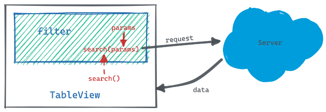

# TableView

`TableView` 是一个以 Table 为主要内容的页面容器，例如订单列表，结算列表。这类页面一般都包含 *搜索*、*表格*、*页脚*、*工具栏* 和 *表格自定义* 几个部分，页面特征明显，可复用性高。`TableView` 允许你传入一个 `columns` 数组即可渲染表格中所有的列，每一列还支持通过 `render` 函数或插槽自定义。此外，它还内置了分页逻辑，并允许用户自定义展示哪些列，但搜索表单部分还需要使用者自己完成，并通过插槽嵌入 `TableView`。

**COMPLETED**  
✅ 分页逻辑  
✅ 数据驱动表格  
✅ 自定义列(render、插槽)    
✅ scopedSlot `filter`  
✅ slot `toolBar`  
✅ 表格自定义  

**WORKING**  
🚧 scopedSlot `tabBar`

---
<!-- TOC anchorMode:gitlab.com -->

- [TableView](#tableview)
  - [TableView 结构](#tableview-结构)
  - [使用](#使用)
    - [基本用法](#基本用法)
    - [深入 `column` 对象](#深入-column-对象)
    - [如何自定义列？](#如何自定义列)
    - [如何请求数据？](#如何请求数据)
    - [如何搜索？](#如何搜索)
    - [如何使用内置的自定义列表组件](#如何使用内置的自定义列表组件)
  - [API](#api)
    - [props](#props)
    - [slots](#slots)
    - [methods](#methods)

<!-- /TOC -->

---

## TableView 结构

`TableView` 结构如下图：  


**internals** 为组件内置的功能，包括 `Table`部分的列表渲染，`footer`部分的分页，还有 `customer` 部分的列表自定义(自定义展示哪些列)。  

**slots** 插槽当前包含：
+ `filter`:   
  页面筛选器，嵌入搜索表单

+ `tabBar`:   
  有些页面顶部需要 tab 切换，例如订单管理模块下的待审列表，其又细分为 “待初审”，“初审退回” 等状态。

+ `toolBar`:   
  工具栏部分，可在此出嵌入一些按钮，如：导出，新增。

## 使用
### 基本用法
  

图中红色部分即为 `TableView`, 使用者传入一个 columns 数组即可渲染出表格，代码如下：
```html
<template>
  <table-view
    :columns="columns"
    get-list-method="getDataList"
  >
    <template #filter="{ search }">
      <order-filter
        @search="search($event)"
        @reset="search($event)"
      />
    </template>

    <template #toolBar>
      <el-button
        type="primary"
        size="small"
      >导出</el-button>
    </template>
  </table-view>
</template>

<script>
export default {
  // ...
  data() {
    return {
      columns: [
        {
          label: 'Name',
          prop: 'name',
        },
        {
          label: 'Age',
          prop: 'age'
        },
        {
          label: 'Address',
          prop: 'address'
        }
      ]
    };
  },

  methods: {
    async getDataList(params) {
      const res = await Api.getList(params)
      return {
        listData: res.list,
        total: res.total,
        page: res.page
      }
    }
  }
};
</script>
```

### 深入 `column` 对象
```js
{
  // required
  label: '姓名',

  // required
  prop: 'name',

  // ElTableColumn 的属性
  elProps: {
    fixed: true,
  },
  
  // 是否展示
  // 组件prop `useColumnCustomer` 为 true 时生效
  // show 为 false 的列隐藏
  show: true,
  
  // 可通过 render 函数自定义每列展示的内容
  // row: 行数据
  // col: 列数据
  // rowIdx: 行索引 (从0开始)
  // colIdx: 列索引 (从0开始)
  render(h, { row, col, rowIdx, colIdx }) {
    return h(
      'div', 
      { /* ... */ },
      `${row.name}`
    )
  }
}
```

### 如何自定义列？
`TableView` 支持通过 *`render` 函数* 和 *插槽* 两种方式自定义列  
> 注意：render 优先级高于插槽

**1. render函数**  

给需要自定义的列设置一个 render 函数, 你可以通过 render 函数渲染想要的内容。如果你自定义的内容比较复杂，你可以像操作列那样，封装一个组件传给渲染函数。
```javascript
import OperationWidget from './OperationWidget.vue'

export default {
  // ...
  data() {
    return {
      columns: [
        {
          label: '姓名',
          name: 'prop',
          render(h, { row, col, rowIdx, colIdx }) {
            return h(
              'div', 
              { /* ... */ },
              `${row.name}`
            )
          }
        },
        {
          label: '操作',
          prop: 'operation',
          render(h, { row }) {
            return h(OperationWidget, {
              props: {
                orderInfo: row
              }
            })
          }
        }
      ];
    }
  }
}
```

**2. 插槽**  

`TableView` 允许你通过具名插槽自定义列，插槽名为列的 `prop`

```html
<template>
  <table-view
    :columns="columns"
    :get-list-method="getListMethod">
    <!-- 'name' 插槽会自定义 prop 为 'name' 的列 -->
    <template #name="{ row }">
      <!-- slot what you want -->
      <div>{{ row.name }}</div>
    </template>
  </table-view>
</template>
```

### 如何请求数据？
`TableView` 要求使用者在 `getListMethod` 里调用接口并回填数据， getListMethod有两种写法： 
 
**1. 异步写法**   

第一种是写一个返回 `Promise` 的函数, Promise 需 resolve 接口返回的数据，就像这样：
```javascript
export default {
  // ...
  methods: {
    async getDataList(params) {
      const res = await Api.getList(params)
      return {
        listData: res.list, // 表格数据
        total: res.total,   // 总数
        page: res.page      // 当前页数
      }
    }
  }
}
```

**2. 回调写法**

`TableView` 内部在调用 `getListMethod` 的时候会传两个参数，第一个是请求参数，第二个则是一个回调函数，用于设置数据, 所以 `getListMethod` 也可使用如下写法：
```javascript
export default {
  // ...
  methods: {
    async getDataList(params, callback) {
      const res = await Api.getList(params)
      callback({
        listData: res.list, // 表格数据
        total: res.total,   // 总数
        page: res.page      // 当前页数
      })
    }
  }
}
```

### 如何搜索？
`TableView` 需要使用者自己整理搜索条件，然后手动调用内部方法 `search`，如图：



有两种方式调用 `search`： 

**1. 通过作用域插槽**  
可以通过作用域插槽拿到组件内部的 `search` 方法, 直接调用
```html
<table-view
  :columns="columns"
  get-list-method="getDataList"
>
  <template #filter="{ search }">
    <order-filter
      @search="search($event)"
      @reset="search($event)"
    />
  </template>
</table-view>
```
```javascript
export default {
  // ...
  methods: {
    async getDataList(params) {
      const res = await Api.getList(params)
      return {
        listData: res.list,
        total: res.total,
        page: res.page
      }
    }
  }
}
```


**2. 通过 ref**  

通过 ref 访问组件实例并调用 `search`
```html
<table-view
  ref="tableView"
  :columns="columns"
  get-list-method="getDataList"
>
  <template #filter>
    <order-filter
      @search="search($event)"
      @reset="search($event)"
    />
  </template>
</table-view>
```
```javascript
export default {
  // ...
  methods: {
    search(params) {
      this.$refs.tableView.search(params)
    }
  }
}
```

### 如何使用内置的自定义列表组件
`TableView` 内置了自定义列的组件，支持用户勾选想展示的列，隐藏多余的列。  
 
想要使用此功能，需要设置 `useColumnCustomer` 为 `true`, 同时给组件传递 `columnCustomMethod` 方法。你需要通过 `columnCustomMethod` 更新 `columns`, 把自定义展示的列的 `show` 设为 `true`, 其他列的 `show` 设为 `false`。

```html
<table-view
  :columns="columns"
  use-column-customer
  :column-custom-method="columnCustomMethod"
  get-list-method="getDataList"
>
  <!-- ... -->
</table-view>
```
```javascript
export default {
  // ...
  methods: {
    /**
     * 处理列表自定义
     */
    columnCustomMethod(columnProps) {
      this.columns = this.columns.map(col => ({
        ...col,
        show: columnProps.includes(col.prop)
      }))
      // ...
    }
  }
}
```

当然你还可以更进一步，在 `columnCustomMethod` 里保存用户自定义的数据，下次渲染列表的时候根据保存的数据把 `columns` 对应的列的 `show` 设为 `true`。
  


## API

### props
| prop       | 类型   | 是否必须 | 默认 | 描述   
|------------|--------|---------|------------|------------|
| columns    | Array  | 是       | - | 列表渲染的列 |
| gitListMethod | Function | 是 | - | 请求接口函数     |
| autoFetch | Boolean | 否 | true | 是否自动请求数据     |
| elTableProps | Object | 否 | {} | 通过此属性给 `ElTable` 配置 props
| useSelection | Boolean | 否 | false | 是否展示选择框列
| defaultSearchParams | Object | 否 | {} | 如果页面搜索含有默认参数且 `autoFetch` 为true, 可通过此属性设置默认参数
| columnAlign | 'left'、'center'、'right' | 否 | 'left' | 表格对齐方式。如果你想单独设置某一列的对齐方式，可通过 `column` 对象的 `elProps.align` 进行设置
| useColumnCustomer | Boolean | 否  | false  | 使用列表自定义     |
| columnMinCount | Number | 否  | 3  | `useColumnCustomer` 为 true 时有效，限制最少列数     |
| columnCustomMethod | Function | `useColumnCustomer` 为 true 时必传  | -  | 列表自定义方法，columnCustomMethod(props), 调用参数 props 是一个数组，包含所有选中的列的 prop   |


### slots
| slot | 作用域 | 描述 |
| ------| ---- | ----|
| filter | { search } | 搜索筛选
| toolBar | - | 表格工具栏
| tabBar | - | 顶部 tab
| [column.prop] | { row, col, rowIdx, colIdx } | 每一列支持动态插槽，插槽名为列的 prop


### methods
| method | 参数 | 描述 |
| ------| ---- | ----|
| search | search(params: object) | params 为搜索条件
| setSearchParams | setSearchParams(params: object) | 设置搜索条件
| getParams | () => params | params 为请求接口的完整参数，包括分页参数
| fetchListData | fetchListData()  | 如需手动控制接口请求数据 (`autoFetch` 为 false), 可调用此方法发起请求。注意此方法无需传参数，其内部会调用 `getListMethod`
| getElTable | () => ElTable | 返回 ElTable 实例，可通过此方法访问 ElTable
